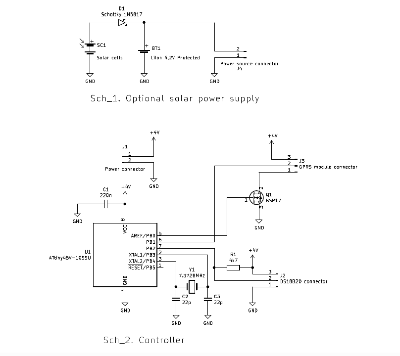
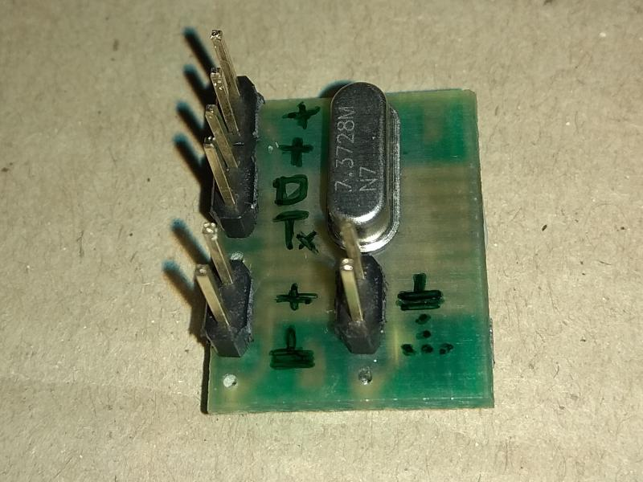
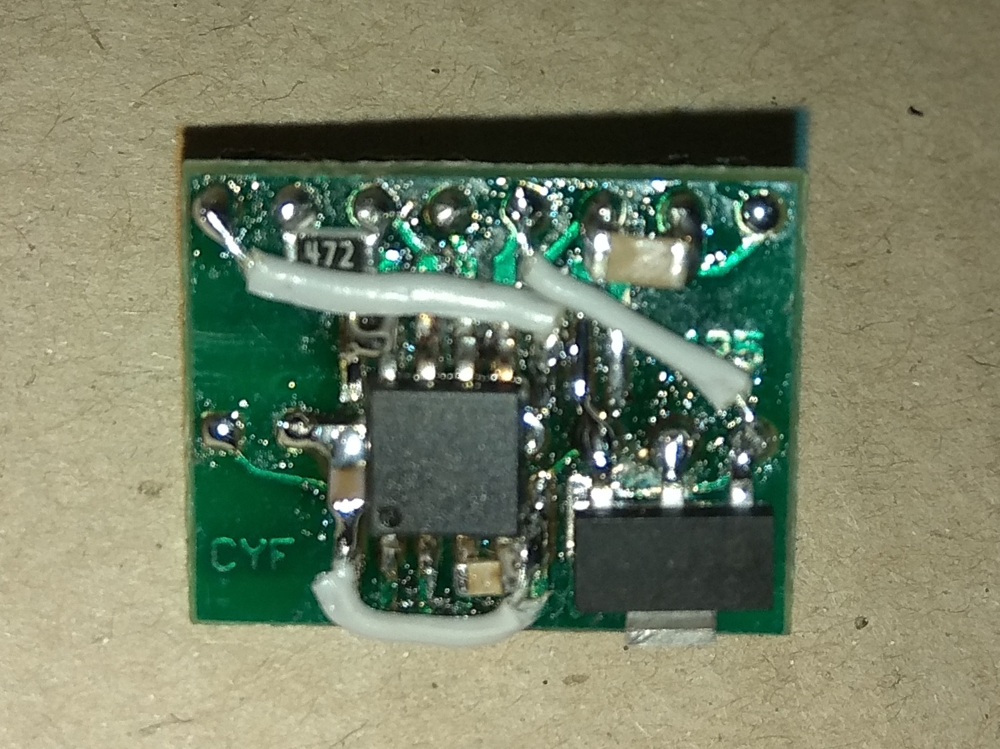

# DS28B20 thingspeak GPRS sender 

Project of simple adapter designed for sending data from DS18B20 temperature sensor to thingspeak service using Air200t GPRS module.
The device obtains temperature data from DS18B20 sensor and sends value to the thingspeak channel. Process is repeated in infinite loop.

## Hardware

The device is based on ATtiny45. The design is as simple as possible. An external oscillator was used to maintain stable serial communication in wide range of environment temperatures.

The microcontroller communicates with the GPRS module using AT commands. It was tested with Air200t module. I suppose that it should work also with other gprs modules.

Power source for a gprs module is switched by the NMOS transistor. It allow to limit of wasting energy between sending periods. 

Universal SO16 to DIP16 adapter PCB was used for mounting all components and connectors. 

## Software

Project is developed under Eclipse with the AVR plugin. Project files are attached.

Program is simple loop. First a temperature is fetched from DS18B20 and next AT command sequence is send to Air200t gprs module. After that the module is switched off till the next sending time.
During this time interval the AVR cpu waits in energy saving mode PWR_DOWN and GPRS module is off. Sensor DS18B20 is always connected to power supply, but standby power consumption is declared only on 1uA. 

#### Settings

There is need to set thingspeak channel and gprs connection parameters (APN) in the __config.h__ file before project compilation. Parameters are commented in the file.

Serial baud rate is defined on 19200 bps. Change baud rate in GPRS module before use by AT command:
`AT+IPR=19200`

#### TODOs

Adding support for next temperature sensors - planed in next commits.

#### Used external projects

A [avr-ds18b20 library](https://github.com/Jacajack/avr-ds18b20) was used for sensor communication.

Serial communication using ATtiny USI module is based on [USI Serial UART Send on ATtiny](http://becomingmaker.com/usi-serial-send-attiny/) article.

## License

This project is licensed under the MIT.

